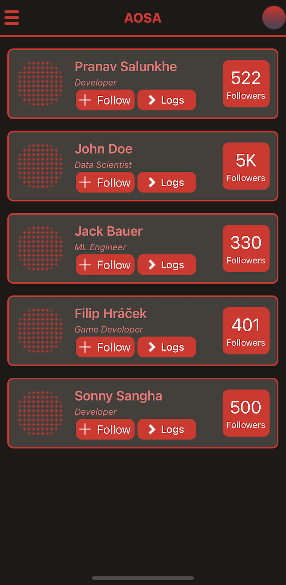

# Aosa
> A social media platform for being productive and learning on the go.

# Snapshot of the App




# About the app
  The app is a social media platform for tech enthusiasts to join and showcase their work.
  + The home page of the app lists out the ```Following```, ```Trending``` and ```Suggested``` tech personalities to 
  + The ```>logs``` is a feature for the users to show what they are currently working on.

# How to run?
+ Clone the repository using ```git clone <url-of-repo>```
+ Install dependencies using ```npm i```
+ Start the expo app using ```npm start```
+ Choose the target device: iOS, Android, Web

# Contributing
  I'm working on this app as a hobby project. This project is open for contributions from anyone and everyone.
  To contribute:
+ Fork the repository.
+ Clone it to your local device.
+ Run in dev setup
+ Make your changes and add commit messages
+ Push your changes to a separate branch with the name as: ```<your_username>```
+ Submit a PR

# Tech Stack
           

  
